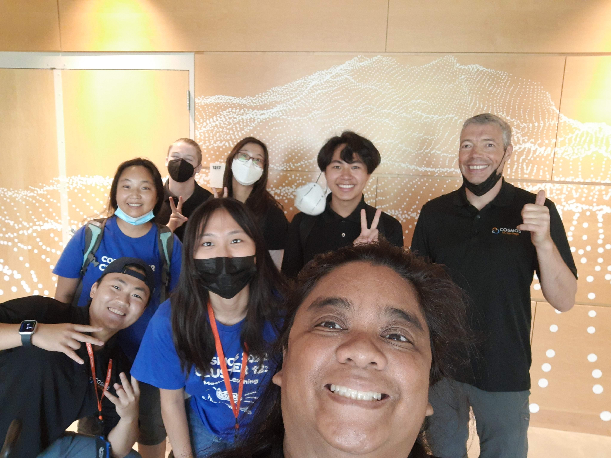
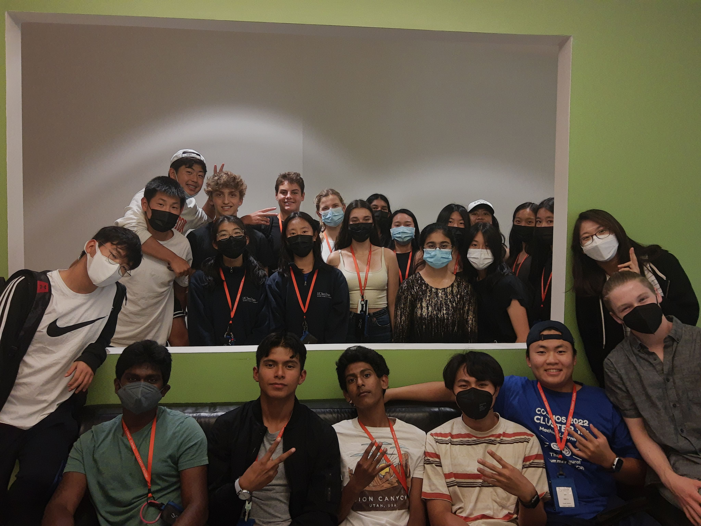

# COMOS-2022-Cluster12
This repository contains all the developmental materials of the lab activities on clustering.

## Short-Introduction-to-COSMOS-and-Cluster-12

  Here is a picture of the awesome staff group. 
  We have from left to right, myself, <a href="https://www.soohyunnamliao.com/">Sooh</a>, <a href="https://www.linkedin.com/in/john-driscoll-/">John</a>, <a href="https://www.linkedin.com/in/wenhua-liang-4922721a4/">Wendy</a>, <a href="https://www.linkedin.com/in/jeannie-kim-504552190/">Jeannie</a>, <a href="https://www.linkedin.com/in/henrytluu/?trk=public_profile_browsemap">Henry</a>, <a href="https://mrsmiranda.com/">Shirley</a>, and <a href="https://jacobsschool.ucsd.edu/people/profile/curt-schurgers">Curt</a>. 
  Sooh and Curt are the lead cluster instructors, Shirley is the cluster teacher fellow and coordinator, and the rest of the crew are cluster assistants. At our cluster, we teach awesome and cool machine learning topics to prospective high school students, which range from classic clustering algorithms and regressions to natural language processing, and ultimately to deep learning and neural networks! We had an absolute blast this summer of 2022. 
  To learn more about the greater COSMOS program, hit the link <a href="https://jacobsschool.ucsd.edu/cosmos">here</a>. 
  

  Our program official runs from June to August, but the technical works revolving content development, coordination, and cleanup started as early as late April and May! All lab exercises, tasks, and projects are originally-made by the cluster assistants! To have an overview of what we and the students have collaboratively achieved if interested, follow and <a href="https://ucsdcosmoscluster12-2022.blogspot.com/">link</a> and visit the blog post generously kept and put together by Shirley! 
  Here is a picture of the cluster assistants with our students! 
  

